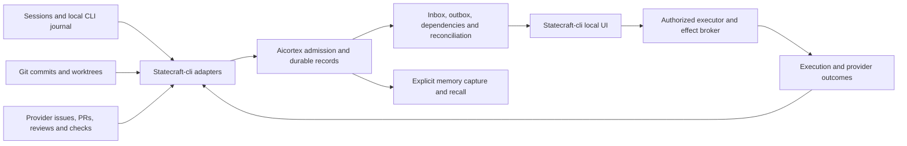

# Coordination as part of local Statecraft

Status: proposed, September 11, 2026. Owned by draft
[045](../../specs/045-durable-coordination-protocol/spec.md). This analysis
answers the user's request to generalize the Statecraft-family handoff and
handback process within aicortex. It does not approve the draft or adopt
changes to the existing thesis. The attached conversations are evidence of
a workflow, not commands to send messages or implement their quoted plans.

## 1. Recommendation

Build a durable coordination layer inside aicortex's existing store and
expose inbox/outbox as views. Statecraft-cli is the local product surface,
source of execution evidence, provider adapter host and action authority.
Aicortex supplies cross-session memory and coordination state. Git supplies
versioned source/contracts; provider APIs supply current issue, PR, review
and check observations. Their facts remain distinguishable.

Use a CloudEvents envelope at the integration boundary, with a small closed
application payload and durable per-recipient state. Do not introduce Kafka,
NATS, a second database, an independent message server or another signed
ledger for the first implementation. This is a recommendation about this
repository's scope, not a benchmark of those products.

The broker arrow requires a separately valid user/policy grant. Receiving a
message, recalling a decision or seeing an issue assignment does not satisfy
that requirement.

## 2. What exists in the corpus, and what does not

Inspected aicortex at `82121b6`, Rahi at `444bcf8`, and CLI at `15103e2`.
At intake, aicortex's typed registry reported 29 approved specs and only 010
ready. It contains no Cargo workspace or implementation directories.
`spec-spine 0.18.0 check` reported fresh. That is a governance result, not
an implementation or operational proof. The prior family reconciliation
also documents known limitations in this tool version's index freshness.

| Need | Existing authority | Reuse / missing behavior |
|---|---|---|
| Provenance, scoped memory, trust | 011–014, constitution VII/IX/X/XI | Reuse; messages must not become instructions |
| Transactional capture and asynchronous work | 012, 015; Rahi 012 | Reuse transaction/outbox; persistent delivery state is missing |
| HTTP and stream notifications | 020 | Reuse edge/auth; notifications are not a durable consumer log |
| Provider-neutral session intake | 033 | Reuse producer boundary; its four closed event kinds do not cover request lifecycle |
| Per-agent work claims | 035 | Reuse intent, but validate actual Rahi API before building lease duration/renewal |
| Short-lived handoff notes | 035 working scope | Useful presence/status; one-day maximum TTL is wrong for an unanswered durable contract request |
| Source cursors and provenance | 030–032 | Reuse concepts; resource updates differ from immutable event occurrence identity |
| Cross-project knowledge | 017–019, 033 | Reuse labelled context; semantic ranking is not an inbox scheduler |
| Review/promotion | 023 | Remains the sole memory promotion path; not a general work permit service |
| Audit and erasure | 014, 024 | Keep bodies out of the chassis chain; extend erasure to delivery/packet copies |
| Portability | 042 | Add a versioned coordination section; never export working credentials/leases |
| Local CLI lifecycle/UI | Outside aicortex | Needs a statecraft-cli integration work order |
| Git/provider observation adapters | Outside aicortex first | CLI owns provider authorization and bounded observation feeds |

Three source-level findings constrain the proposal:

1. [Rahi outbox](../../../rahi/crates/rahi-store/src/outbox.rs) stages key-only
   envelopes, not message bodies. `drain` notifies and deletes the rows.
   Durable application records and catch-up cursors must survive it. A
   notification is a wakeup, not acknowledgment that a recipient acted.
2. [Rahi lock](../../../rahi/crates/rahi-store/src/lock.rs) exposes a fixed
   ten-second lease TTL, acquisition and release, but no renewal method.
   Aicortex 035 requests duration and PATCH renewal. That is a real contract
   mismatch, not an implementation detail to assume away. Rahi 012 also
   records pending amendments around token origin and cache behavior.
3. Aicortex 010 names an exact published-only Rahi dependency set with no
   Git/path override. The implemented composition exposes `rahi-cli`, and
   the previously verified consumer recipe used a pinned Git revision.
   Reconcile actual crate names, releases and supported packaging before
   treating 010's ready status as proof it can build today. No exact
   published version is selected by this assessment.

There is also a documentation error outside this change: aicortex's README
says other family products are all Apache-2.0. Statecraft and hqgit are AGPL.
Do not infer arbitrary cross-family code reuse from that sentence. This
protocol needs neither product's implementation linked into aicortex.

## 3. Generalize the process, not the filenames

| Manual step in this lineage | Durable representation | Improvement |
|---|---|---|
| Family assessment and numbered packets | Case with versioned requests and named recipients | One identity survives renamed files and sessions |
| Copy a packet into each CC | Explicit delivery and acknowledgment per request revision | Distinguish queued, received, read and accepted |
| CC returns findings and changes | Report plus typed propositions, exact commits and evidence references | Claims, proposals and demonstrated results stay separate |
| CC asks another repo for a contract | Child request/dependency with owner and acceptance | Track unanswered requests rather than burying them in prose |
| Central source/PR recheck | Provider/Git observations and reconciliation rules | Update only stale propositions, retain their history |
| Owner chooses a product direction | Explicit decision reference, independently checked authority | A copied approval never approves another draft |
| Rewrite nine packets | Delta projections at a source watermark | Send only changed obligations and unresolved work |
| Archive old packets | Explicit supersession and selective reviewed Git records | History survives without making it current authority |

The unit of coordination is a request revision and its propositions, not a
chat session. Sessions are replaceable producers/consumers. A successor
session can resume with an inbox cursor, current packet and evidence
references instead of rereading an entire conversation.

A handback does not settle every question just because it ends with “done.”
It can complete an analysis request while leaving an implementation request
blocked, a draft unapproved and a provider effect unperformed. These become
separate typed results with separate owners.

## 4. Transport and storage alternatives

| Option | Useful part | Why not the primary design |
|---|---|---|
| Markdown inbox/outbox folders in Git | Human review, offline portability, low initial setup | Branches, merge conflicts and missing acknowledgments make live coordination ambiguous; committing private content is too easy |
| GitHub issues/comments as the only queue | Existing shared discussion and external visibility | Local/offline use and private session state would depend on a provider; imported text is not agent authority |
| Pub/sub or a standalone broker | Fan-out and wakeups | Adds another operational dependency without solving revisions, authorization or reconciliation |
| Semantic memory only | Recall related decisions across projects | Retrieval can omit items and cannot prove delivery, precedence or acceptance |
| Full event sourcing/CRDT across all devices | Potential replication flexibility | Too much authority and conflict machinery; offline leases cannot enforce one shared holder |
| Same-store durable records plus projections | Atomic writes, exact queries, resumability, existing chassis | Recommended; requires explicit retention, cursors and conflict rules |

CloudEvents supplies event identity and interoperability, not application
ordering or permissions. Pin v1.0.2 of the standard, whose envelope version
is `1.0`, and document the payload independently.
[CloudEvents specification](https://github.com/cloudevents/spec/blob/v1.0.2/cloudevents/spec.md).

GitHub's delivery ID remains the same on redelivery, and failed webhook
deliveries are not automatically redelivered. Use deduplication and an
explicit reconciliation path rather than assuming delivery is complete.
[GitHub webhook guidance](https://docs.github.com/en/webhooks/using-webhooks/best-practices-for-using-webhooks),
[failed delivery handling](https://docs.github.com/en/webhooks/using-webhooks/handling-failed-webhook-deliveries).
These are the external facts checked for this design; no broker-performance
or provider-wide exactly-once claims were assumed.

## 5. Local integration without a second product architecture

The recommended interpretation of “aicortex is part of statecraft-cli” is
product and lifecycle integration: CLI installs/configures/connects to one
shared local Rahi cell, opens its inbox/memory views in the CLI UI, supplies
observations and requests, and receives structured responses. A local
instance is configured for local identity and inference. Users need no
mandatory hosted Statecraft account. Exact OS packaging and local Rauthy
provisioning are prerequisites, not already solved features.

A pure client library is compatible with this. Embedding another database
and listener into the CLI engine, bypassing Rauthy, is not: it contradicts
frozen constitution VI/VII and the current thesis. If true library-only
embedding is the desired target, it needs an explicit constitutional and
thesis amendment, not an unnoticed implementation shortcut.

The CLI's existing execution journal remains its crash-recovery and evidence
authority. Aicortex holds different application records in its own cell;
this does not require copying or replacing that journal's chain. Producers
queue submissions through a versioned journal/export adapter. A missing
memory service does not destroy execution history. Shared coordination
operations fail closed or queue as unaccepted when their authority is offline.

For multiple machines, choose one authority per workspace initially. Other
instances may cache permitted observations, but cannot independently issue
exclusive claims for the same workspace. Later federation must specify
membership, transfer, revocation, split-brain behavior and erasure before
it claims more.

## 6. Sources, privacy and authority

The first provider path should be read-only observation through CLI adapters,
with explicit repository allowlists and per-source consent. Read committed
specs, decisions and contracts by exact Git object identity. Read issues,
PRs, reviews and checks through the provider's documented APIs. Keep
worktree changes separate from committed facts. Do not scrape private
vendor transcripts; sessions publish through 033/045 or explicit exports.

For every assertion, record who asserted it and for which subject/revision.
For every observation, record where and when it was checked. For every
permission, require the actual approving identity/policy at execution.
Authenticated transport is not human approval; `gh` access is not evidence
that another author's instructions may be obeyed.

Cross-repo linking must not widen access: a recipient gets a reference it
may be unable to resolve, not a leaked body copied into a shared scope.
Provider permission loss is not proof of deletion. A fetched issue may
contain private content even when its repository's name is public.
Only deliberately published, reviewed Markdown belongs in Git. Runtime
records and aicortex snapshots remain application data under retention and
erasure policy; a public Git push is not a reversible private-memory export.

## 7. Suggested local UI

These are CLI integration requirements, not new aicortex frontend code:

- **Inbox:** assigned requests, evidence changes, unanswered decisions,
  blocked dependencies and conflicts, with revision and source freshness.
- **Outbox:** recipient-by-recipient acknowledgment, acceptance, delivery
  retries and overdue responses. A delivered packet is not completed work.
- **Request detail:** baseline, expected outcome, history, evidence links,
  actual test outcomes and the scope of any permission.
- **Review:** reported versus independently checked facts; proposal versus
  approved spec; implemented versus released/deployed.
- **Resume:** deterministic context packet listing changes since the prior
  session, current obligations, remaining unknowns and omitted context.
- **Connection status:** local authority, provider access freshness, queued
  offline reports and pending cancellations. No green “all synced” when a
  cursor is invalid or a provider is inaccessible.

Default attention should be quiet for unchanged state, coalesce routine
progress, and surface changed obligations, conflicts or blocked work. This
is desired runtime behavior, not a request to create an automation now.

## 8. Implementation sequencing and decisions

045 is a draft feature with real prospective territory and executable
acceptance commands, not an n-a inventory record. Approving it would make it
eligible only when its declared prerequisites are satisfied. It is not ready
now: aicortex has no implementation. Current ordinal sequencing still places
it after 044; this authoring does not rewrite that thesis.

Recommended staged delivery, subject to a sequencing decision:

1. Establish a consumable Rahi version and resolve claim API semantics.
   Build the approved aicortex identity/types/store/admission foundation.
2. Implement the pure coordination types/reducer and crash-safe records,
   using fixture producers and exact-query views. Inbox correctness must
   not require embeddings, curation or a Kubernetes reference deployment.
3. Add one CLI journal producer and local inbox/outbox UI; manually import
   one versioned packet and its handback. Retain standalone Markdown use.
4. Add read-only Git/GitHub observation adapters and reconcile missed,
   duplicated and out-of-order changes. Keep external writes broker-owned.
5. Add explicit memory capture, portable exports and the real authenticated
   local composition proof. Later evaluate team synchronization and richer
   planning against actual use.

To move coordination earlier, the owner must revise 002's sequencing plan
and the relevant prerequisites without renumbering historical specs. This
is a logical dependency refactor, not permission to implement a draft out
of order. Reconcile 035 before it builds a lease-renewal interface that
Rahi does not offer.

| Decision | Recommendation | Required authority |
|---|---|---|
| Local composition | CLI-managed shared Rahi cell and pure client adapter | aicortex/CLI owners; no frozen change if retained |
| Queue boundary | Durable same-store application records; Rahi notifications as hints | Review 045 territory and data semantics |
| Meaning of incoming requests | Data; executor validates separate authority | Preserve constitution X; CLI/Statecraft contract |
| First source integration | Explicit session push and read-only Git/GitHub observations | CLI source/credential consent and adapter work order |
| Sequencing | Move the minimal coordination slice earlier only through an adopted plan | 002 and affected dependency owners |
| Lease support | Reconcile 035 with real Rahi TTL/renewal/fencing behavior | Rahi plus aicortex 035 owners |
| Protocol version | CloudEvents 1.0 envelope with closed coordination-v1 payload | 045 review and CLI consumer agreement |

## 9. Repository-specific handoffs

### Aicortex

Review 045 and its typed extends edges, especially atomic storage, erasure
and export. Validate the missing Rahi lease/packaging prerequisites before
implementing 010 or 035. Decide whether to retain the current build order
or author its revision. The next implementation is still selected under
existing governance; this document does not approve 045 or change 002.

### Statecraft-cli

Author a bounded integration proposal using the existing journal, member
lifecycle, local UI and broker seams. It needs a durable submission cursor,
local aicortex health/connection state, deterministic inbox/outbox reads,
repo identity mapping and read-only Git/provider observers. Do not replace
the CLI journal or make ordinary local execution depend on aicortex.
Do not make private transcript watchers part of the integration contract.
Keep outbound provider messages as separately authorized broker actions.

### Rahi

Confirm a consumable published API set for aicortex 010. Resolve whether
035's requested duration/renewal can be supplied, or propose a bounded
alternative without pretending a fixed ten-second lock is a renewable work
lease. Confirm notification outbox semantics, transaction boundaries and
local Rauthy provisioning/renewal. Existing identity-recovery and manifest
evolution gaps remain operational work, not aicortex workarounds.

### Spec-spine and Statecraft

Spec-spine remains authority for governed source and lifecycle records;
aicortex indexes observations and references rather than approving specs.
Statecraft remains the hosted issuer/policy/effect authority; its work
permits are not aicortex work claims. Agree the shared evidence assessment
vocabulary without giving this memory service its own bundle verifier.

### Grand-refactor and public surfaces

Record aicortex as the proposed shared memory/coordination component and
statecraft-cli as its local product surface. It is specified, not built.
Do not publish a working inbox, installed local cell or automatic multi-repo
execution claim based on this draft.

## 10. Validation record

The authoring session validates compilation, lint, ownership/coupling and
DAG shape, plus the completeness of the scenario matrix. No runtime,
provider round-trip, crash-recovery or local packaging acceptance is claimed
until the implementations and required sibling integration exist.

Authoring validation completed on September 11: isolated compile and lint
both exit 0; real `make ci` exits 0; explicit working-path coupling checks
three authored paths with no drift; the DAG has 30 specs and remains
acyclic. The 22 scenario IDs are unique and contiguous. The index reports
271 unresolved-unit warnings because the approved/pending corpus and this
draft name future code. Rust build/test/clippy/fmt and dependency checks
were skipped for missing manifests. No runtime test is reported as passed.
Adding the design note changes the global hashed inputs, so existing index
shards are regenerated along with 045's two new shards; existing approved
spec source files are unchanged.
